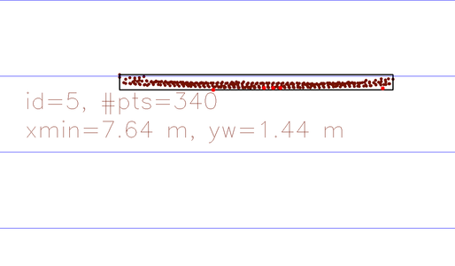

# Data Analysis for 3D Tracking

Thirty five different feature extraction test cases were performed on the sample sequence of images with data written to a CSV file. Sample images were generated showing lidar top view with bounding box and camera view with lidar and keypoint extraction overlay for the center lane vehicle. The processing time and time to collision (TTC) values were recorded for each test case.

The output plots can be generated with new data produced by running `3D_feature_tracking` and following the instructions in the last section of this report.

## Performance Evaluation

### FP.5 Lidar Evaluation

The TTC based on Lidar measurements and processing for each image are shown in the figure below. The trend appears noisier when the vehicle is further away at the the earlier images and there appears to be an outlier in image 6 on the plot. Further discussion of sample images is provided below.


The top view lidar data and accompanying camera image with lidar overlay from image 1 is shown below. The points near left and right edges of the bounding box consistently show the most amount of scatter in the lidar points for all images. This may be due to the vehicle's curved surfaces and light fixtures scattering the lidar laser.


The next two top views and image with lidar overlay show lidar points found in images5, 6 and 7. The red lidar points in the top view depict the rejected outliers due to their distance from the mean x position. In image 6, there is a linear row of lidar points excluded from the point cloud. It appears that with the lidar resolution, it may have caught the edge of the license plat as the car came closer to the sensor but is not seen in images 5 and 7. The slight change in surfaces and protrusion captured by the lidar may have contributed to the large change in TTC between image pairs 5-6 and 6-7.




Image 11 shown below provides an example of a severe outlier lidar point. Fortunately it was filtered out as being too far from the mean x position of the point cloud.


### FP.6 Camera TTC Estimation

35 Different detector-descriptor combinations were tested for the camera-based TTC calculations. However, many of them produced unusable results. A selection of processing result for TTC including the lidar results are shown in the following table:


It can be seen that the trend is not as noisy and more consistent with Lidar as the car comes closer. Image pairs 3-4 and 4-5 seem to have posed the greatest challenge for the camera-based TTC processing. the FAST(detector)-BRISK(descriptor) and BRISK(detector)-BRIEF(descriptor) show outlier TTC peaks at 4 and 5, respectively. The matched keypoints are shown in the following camera views:

#### Image 4 FAST-BRISK

Although difficult to compare without showing matched correspondences, the points lying off the vehicle in the top right of the bounding box may have contributed to the low TTC compared to the trend in the above TTC plots.


#### Image 5 BRISK-BRIEF

There are ery few matches used for the TTC calculation in this example which may have caused a spike inconsistent with TTC trend.


#### Image 4 and 5 FAST-ORB

Here is an example of points that performed well overall. There were more keypoints distributed over the vehicle and perhaps better matching with the ORB descriptor compared to the above examples.


#### Processing Time

The total processing time in milliseconds was recorded on a personal PC Intel i7-8750H produced the times in the following grid:


The Yolo algorithm was ignored as part of the processing time. If we wanted to run at the rate of 10Hz, a more efficient object detection algorithm and/or optimized hardware and software would be required. Given the computer used to run the tests and ignoring Yolo, the SIFT detector would still be too long for 10Hz. The Harris and Shitomasi detectors did not yield good results for TTC. By referring to the TTC plot above, the FAST-BRIEF and FAST-ORB are suitable detectors under 100ms processing time.

## How to Generate Plots From Csv

Create virtual environment and install prerequisites

```bash
python3 -m venv .venv
source ./.venv/bin/activate
python -m pip install numpy matplotlib
```

In file [process3DTrackingData.py](process3DTrackingData.py), modify the following lines to use a different csv file and affect other output parameters:

```python
# input data
data_file = 'analysis/data/results_2020-04-19_12h04m44s/test_data.csv'

# show plots
display_plots = True

# output plot size
plot_size = {
    'width': 7.5,
    'height': 5,
    'dpi': 96
}

# table output size
table_size = {
    'width': 6,
    'height': 9,
    'dpi': 96
}
```

Then run script:

```bash
python ./analysis/process2DfeatureData.py
```
